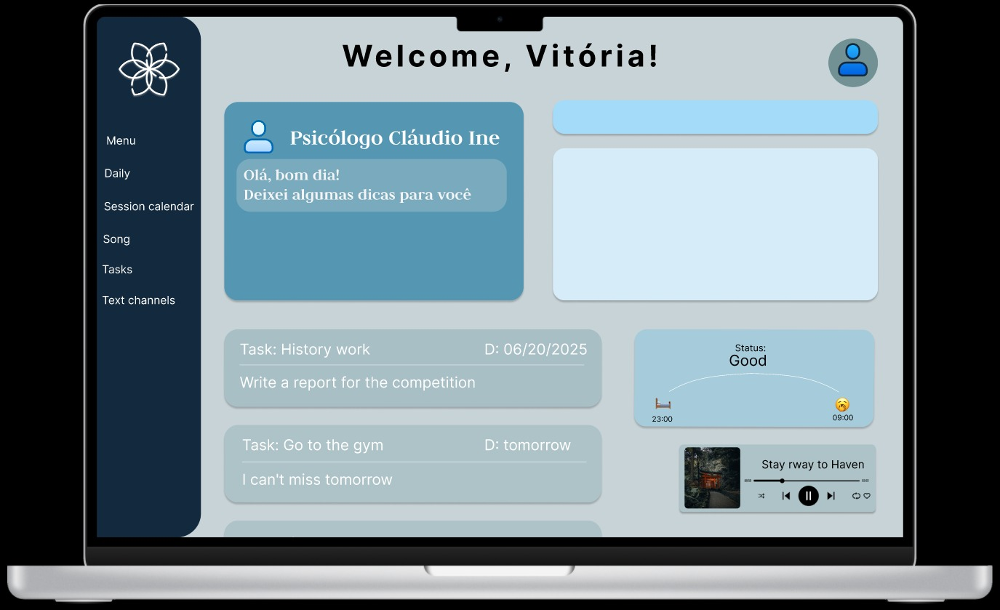

# Relax Mind
Relax Mind se trata de uma iniciativa que busca juntar o melhor da psicologia com tecnologia de forma acessível a todos, nossa ideia parte do principio de um software onde o usuario pode além de ter consultas com profisionais verificados da área, pode também pode se conectar com outros usuarios por meios de grupos, comunidades ou mensagens diretas. Como o software ainda está em desenvolvimento, ainda estamos debatendo sobre ideias e funcionalidades, para contribuir com o nosso projeto ``<INFORMAÇÕES A BAIXO>``. 


## Imagem conceito dashboard - (DESENVOLVIMENTO)


---
## Tecnologias 


## Como instalar nosso projeto?

```bash
git clone https://github.com/Arthursouto099/project_RM.git
cd project_RM
npm install
```
## O que é necessario entender

- Você precisa criar o  arquvo .env, tanto para o cliente quanto para o servidor.

### Criando o arquivo .env para o cliente

```bash
cd project_RM
touch .env
```

### Criando o arquivo .env para o servidor
* Você precisa estar dentro da pasta project_RM
```bash
cd server
touch .env
```


### O que o .env deve ter?
- A rota padrão da api

``
exemplo:
http://localhost:<port>
``


# Autores 

- [@vihfaller](https://github.com/vihfaller)
- [@Arthursouto099](https://github.com/Arthursouto099)


